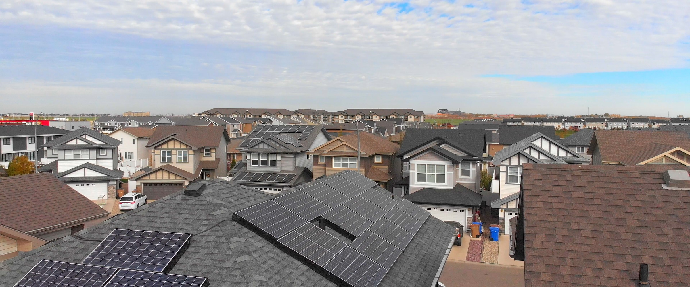
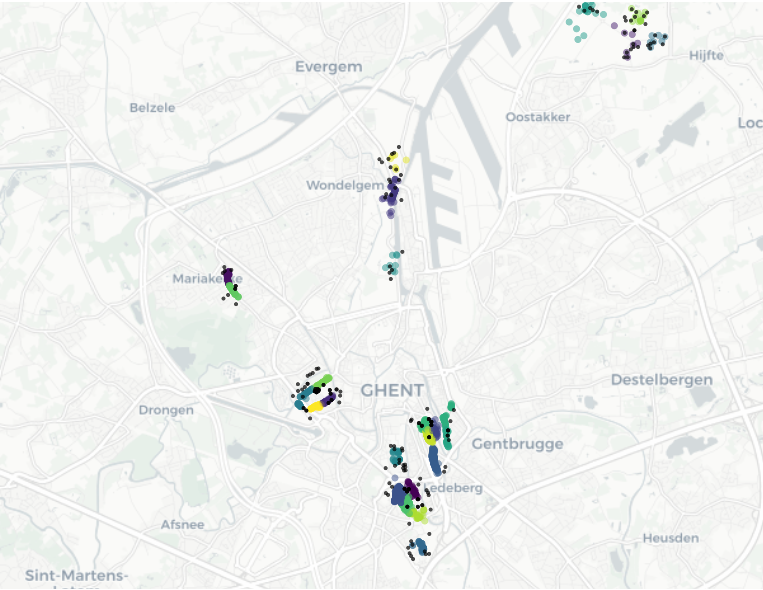

# ecomapper
Opensource package for creating inclusive energy communities



Photo by <a href="https://unsplash.com/photos/hKUJRPAAFWo?utm_source=unsplash&utm_medium=referral&utm_content=creditShareLink">Scott Goodwill</a> on <a href="https://unsplash.com/photos/hKUJRPAAFWo">Unsplash</a>
  


---

<br>

## Table of Contents

- [ecomapper](#ecomapper)
  - [Table of Contents](#table-of-contents)
  - [Project Overview](#project-overview)
  - [Quick Start](#quick-start)
  - [Package Contents](#package-contents)
    - [algorithms](#algorithms)
    - [feature\_eng](#feature_eng)
    - [interactive](#interactive)
  - [References](#references)

## Project Overview

Tools to aid the equitable mapping of renewable resources to communities. Including:

- Functions for engineering relevant features from solar, energy, economic and geographic data.
- Algorithms for clustering communities based on their energy, economic and renewable resources.
- A Community selection tool to help users identify communities to give users the ability to define their own parameters and evaluate the effectiveness of the community.
- An interactive dashboard to visualise the results of the eco-mapping

## Quick Start

Here is an example of the workflow:

```python
from ecomapper.algorithms import CommunitySelect
from ecomapper.data_prep import create_info_table
from ecomapper.feature_eng import get_solar_data
from ecomapper.interactive import map_scatter_plot, top_n_map_scatter_plot

#step1: setup the config.yaml with chosen parameters and paths to data(note: this version is current only compatible with Belgian Cities)
data= create_info_table()
#import solar data for mapping to communities
solar_data = get_solar_data()

#set up energy community environment
community = CommunitySelect(X = data)

#define boundaries (if needed to reduce the number of instances being optimised)
#define criteria
boundaries = {
    "avg_net_tax_income": ("<", 23000),
    "energy_cost_residential_percent_income": (">", 0.08),
    "BIMD2011_score": ("<", 40),
    "top_10_per_energy_prod_in_500m": (">", 1000000),
}

#define energy communities
community.create(
                criteria=boundaries, 
                algorithm='spatial_cluster', 
                num_clusters=30
                )

#show summary stats of the created comumnities
coummunity.get_cluster_summary()

#plot the clusters
fig = map_scatter_plot(community.X_selected)
#plot solar sites that are in 500m of the communities
fig = top_n_map_scatter_plot(community.X_selected,solar_data, radius=500)

fig.plot()
```


## Package Contents
### algorithms
- CommunitySelect() -> For modelling optimal energy communities.
- spatial_cluster() -> For clustering points based on location alone.
- energy_community_reinforcement_learner() -> For creating an RL agent to optimise energy communities based on rewards

### feature_eng
- get_energy_consumption() -> returns energy consumption per street.
- get_ev_points() -> returns number of EV charging points per postcode.
- get_energy_decentral_production() -> returns decentralised energy production per postcode.
- get_average_income() -> returns average income per statistical sector.
- get_address_data() -> returns opensource address data.
- get_sector_boundaries() -> returns statistical sector boundaries.
- get_bimd_data() -> returns BIMD data.
- get_solar_data() -> returns solar data.
- get_sector_population() -> returns population per statistical sector.
- get_urban_atlas() -> returns urban atlas data on land usage.

### interactive
- __main__ -> creates local interactive dashboard for analysing energy communities.
- map_scatter_plot() -> plots derived energy communities on a map.
- top_n_map_scatter_plot() -> plots solar sites on a map with energy communities within a given radius.


## References


